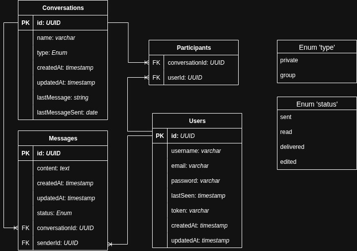

# ArcaneQuest - websocket ChatApp

To install dependencies:

```bash
bun install
```

To run:

```bash
bun run dev
```

This project was created using `bun init` in bun v1.3.9. [Bun](https://bun.com) is a fast all-in-one JavaScript runtime.

## TechStack

Bun + Elysia, Drizzle ORM, [ReactJs](https://github.com/FEX156/react-chat-app)

## Relational Diagram



## Endpoint

### AuthApi

- post => v1/auth/register
- post => v1/auth/login
- patch => v1/auth/session/logout
- post => v1/auth/session/refresh

### UserApi

- get => v1/users
- patch => v1/users
- delete => v1/users

### MessagesApi

- get => v1/messages/:conversationId
- post => v1/messages/:conversationId
- patch => v1/messages/:messageId
- delete => v1/messages/:messageId

### ConversationsApi

- get => v1/conversations
- post => v1/conversations/private
- post => v1/conversations/group
- delete => v1/conversations

<!-- SELECT c.* FROM Conversations c
JOIN Participants p ON c.id = p."conversationId"
WHERE p."userId" = '6f238a67-0092-4b6d-993a-29c419ae4efd'; -->
